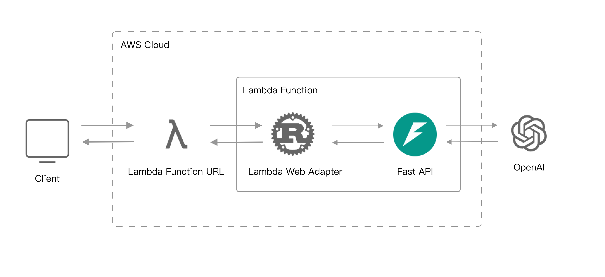

# Serverless Completions Streaming

This example shows streaming response from OpenAI completions with FastAPI on AWS Lambda.

Credit to [aws-lambda-web-adapter](https://github.com/awslabs/aws-lambda-web-adapter)



## How does it work?

This example uses FastAPI provides inference API. The inference API endpoint invokes OpenAI, and streams the response. Both Lambda Web Adapter and function URL have response streaming mode enabled. So the response from OpenAI are streamed all the way back to the client. 

This function is packaged as a Docker image. Here is the content of the Dockerfile. 

```dockerfile
FROM public.ecr.aws/docker/library/python:3.12.0-slim-bullseye

COPY --from=public.ecr.aws/awsguru/aws-lambda-adapter:0.8.1 /lambda-adapter /opt/extensions/lambda-adapter

# Copy function code
COPY . ${LAMBDA_TASK_ROOT}
# from your project folder.
COPY requirements.txt .
RUN pip3 install -r requirements.txt --target "${LAMBDA_TASK_ROOT}" -U --no-cache-dir

CMD ["python", "main.py"]
```

Notice that we only need to add the second line to install Lambda Web Adapter. 

```dockerfile
COPY --from=public.ecr.aws/awsguru/aws-lambda-adapter:0.8.1 /lambda-adapter /opt/extensions/
```

In the SAM template, we use an environment variable `AWS_LWA_INVOKE_MODE: RESPONSE_STREAM` to configure Lambda Web Adapter in response streaming mode. And adding a function url with `InvokeMode: RESPONSE_STREAM`. 

```yaml
  FastAPIFunction:
    Type: AWS::Serverless::Function
    Properties:
      PackageType: Image
      MemorySize: 512
      Environment:
        Variables:
          AWS_LWA_INVOKE_MODE: RESPONSE_STREAM
      FunctionUrlConfig:
        AuthType: NONE
        InvokeMode: RESPONSE_STREAM
      Policies:
      - Statement:
        - Sid: BedrockInvokePolicy
          Effect: Allow
          Action:
          - bedrock:InvokeModelWithResponseStream
          Resource: '*'
```      

## Build and deploy

Run the following commends to build and deploy this example. 

```bash
sam build --use-container
sam deploy --guided
```

## Test the example

After the deployment completes, curl the `FastAPIFunctionUrl`.

```bash
curl -v -N --location '${{FastAPIFunctionUrl}}/api/chat/stream' \
--header 'Content-Type: application/json' \
--header 'Transfer-Encoding: chunked' \
--data '{"messages":[{"role":"user","content":"Count to 100, with a comma between each number and no newlines. E.g., 1, 2, 3, ..."}],"prompt":""}'
```


